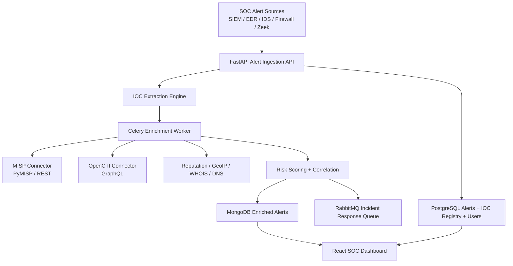

# Architecture

## High-Level Design

## Components

- `backend/`: FastAPI APIs, auth, IOC CRUD, alert ingestion, enrichment orchestration, Celery task definitions, storage access, and simulated incident forwarding.
- `frontend/`: React dashboard with alert monitoring, IOC explorer, summary metrics, and relationship graph visualization.
- `sample-data/`: IOC and alert fixtures used to simulate SOC telemetry and enrichment results.
- `docker-compose.yml`: Local deployment for the application services.

## Core Workflow

1. Alert arrives through `POST /api/alerts`.
2. Backend extracts IOCs from structured fields and free text payload.
3. Alert metadata is stored in PostgreSQL.
4. Celery publishes enrichment work through RabbitMQ and uses Redis as result backend/cache.
5. Enrichment service correlates local IOC registry data with MISP, OpenCTI, and mock reputation services.
6. Enriched alert document is stored in MongoDB.
7. Incident response action is queued for downstream responders.
8. Dashboard queries summary metrics, IOC records, enriched alerts, and graph relationships.

## Observability

- Application logs are emitted in structured JSON format.
- MongoDB audit collections track enrichment and incident queue events.
