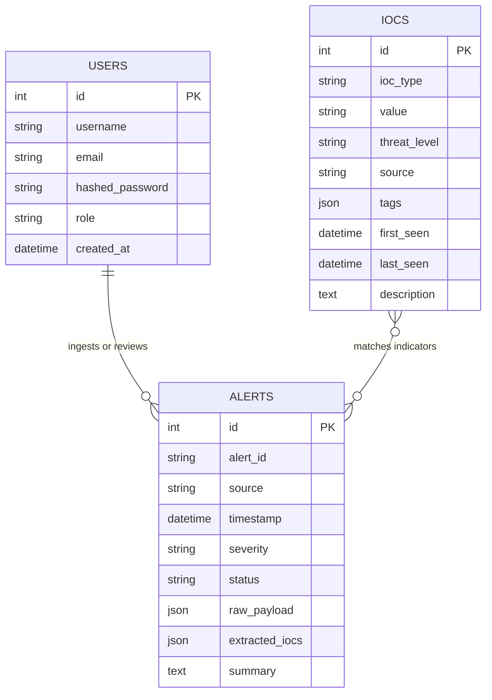

# ER Diagram

```mermaid
erDiagram
    USERS {
        int id PK
        string username
        string email
        string hashed_password
        string role
        datetime created_at
    }

    IOCS {
        int id PK
        string ioc_type
        string value
        string threat_level
        string source
        json tags
        datetime first_seen
        datetime last_seen
        text description
    }

    ALERTS {
        int id PK
        string alert_id
        string source
        datetime timestamp
        string severity
        string status
        json raw_payload
        json extracted_iocs
        text summary
    }

    USERS ||--o{ ALERTS : "ingests or reviews"
    IOCS }o--o{ ALERTS : "matches indicators"
```

## Document Collections

- `enriched_alerts`
- `audit_logs`
- `incident_queue`

